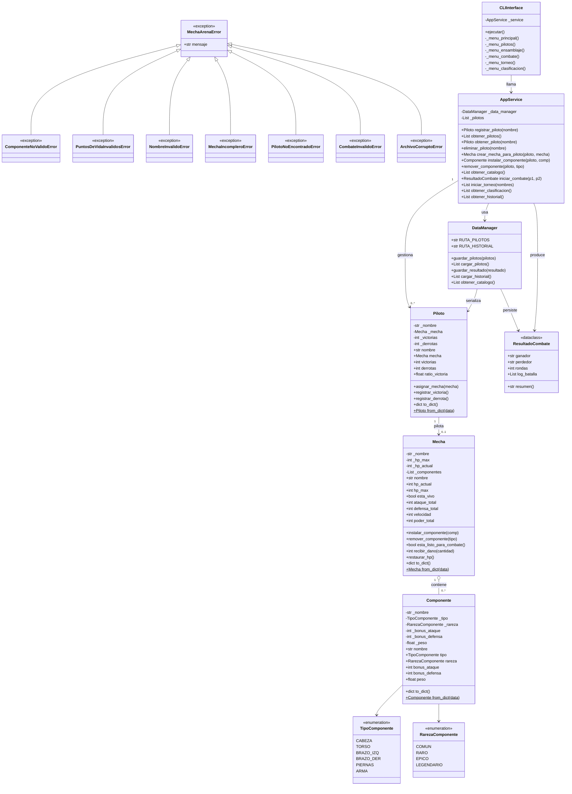
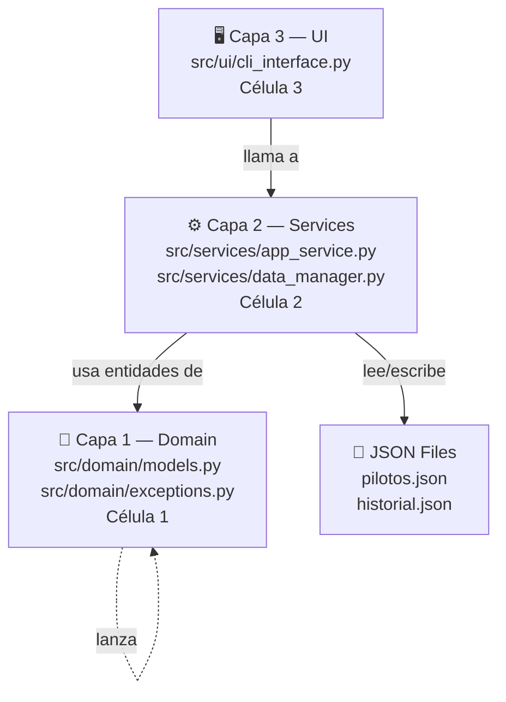
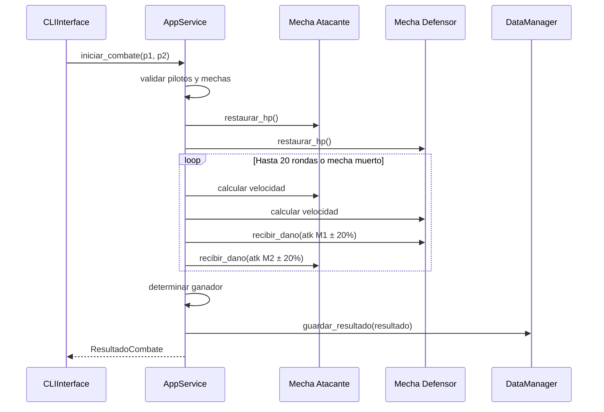

# Arquitectura — Mecha-Arena

Diagrama de clases UML del sistema completo en sintaxis Mermaid.

## Diagrama de Clases

```mermaid
classDiagram
    direction TB

    %% ── ENUMERACIONES ──────────────────────
    class TipoComponente {
        <<enumeration>>
        CABEZA
        TORSO
        BRAZO_IZQ
        BRAZO_DER
        PIERNAS
        ARMA
    }

    class RarezaComponente {
        <<enumeration>>
        COMUN
        RARO
        EPICO
        LEGENDARIO
    }

    %% ── CAPA DOMINIO ───────────────────────
    class Componente {
        -str _nombre
        -TipoComponente _tipo
        -RarezaComponente _rareza
        -int _bonus_ataque
        -int _bonus_defensa
        -float _peso
        +str nombre
        +TipoComponente tipo
        +RarezaComponente rareza
        +int bonus_ataque
        +int bonus_defensa
        +float peso
        +dict to_dict()
        +Componente from_dict(data)$
    }

    class Mecha {
        -str _nombre
        -int _hp_max
        -int _hp_actual
        -List _componentes
        +str nombre
        +int hp_actual
        +int hp_max
        +bool esta_vivo
        +int ataque_total
        +int defensa_total
        +int velocidad
        +int poder_total
        +instalar_componente(comp)
        +remover_componente(tipo)
        +bool esta_listo_para_combate()
        +int recibir_dano(cantidad)
        +restaurar_hp()
        +dict to_dict()
        +Mecha from_dict(data)$
    }

    class Piloto {
        -str _nombre
        -Mecha _mecha
        -int _victorias
        -int _derrotas
        +str nombre
        +Mecha mecha
        +int victorias
        +int derrotas
        +float ratio_victoria
        +asignar_mecha(mecha)
        +registrar_victoria()
        +registrar_derrota()
        +dict to_dict()
        +Piloto from_dict(data)$
    }

    class ResultadoCombate {
        <<dataclass>>
        +str ganador
        +str perdedor
        +int rondas
        +List log_batalla
        +str resumen()
    }

    %% ── EXCEPCIONES ────────────────────────
    class MechaArenaError {
        <<exception>>
        +str mensaje
    }
    class ComponenteNoValidoError { <<exception>> }
    class PuntosDeVidaInvalidosError { <<exception>> }
    class NombreInvalidoError { <<exception>> }
    class MechaIncompleroError { <<exception>> }
    class PilotoNoEncontradoError { <<exception>> }
    class CombateInvalidoError { <<exception>> }
    class ArchivoCorruptoError { <<exception>> }

    %% ── CAPA SERVICIOS ─────────────────────
    class DataManager {
        +str RUTA_PILOTOS
        +str RUTA_HISTORIAL
        +guardar_pilotos(pilotos)
        +List cargar_pilotos()
        +guardar_resultado(resultado)
        +List cargar_historial()
        +List obtener_catalogo()
    }

    class AppService {
        -DataManager _data_manager
        -List _pilotos
        +Piloto registrar_piloto(nombre)
        +List obtener_pilotos()
        +Piloto obtener_piloto(nombre)
        +eliminar_piloto(nombre)
        +Mecha crear_mecha_para_piloto(piloto, mecha)
        +Componente instalar_componente(piloto, comp)
        +remover_componente(piloto, tipo)
        +List obtener_catalogo()
        +ResultadoCombate iniciar_combate(p1, p2)
        +List iniciar_torneo(nombres)
        +List obtener_clasificacion()
        +List obtener_historial()
    }

    %% ── CAPA UI ────────────────────────────
    class CLIInterface {
        -AppService _service
        +ejecutar()
        -_menu_principal()
        -_menu_pilotos()
        -_menu_ensamblaje()
        -_menu_combate()
        -_menu_torneo()
        -_menu_clasificacion()
    }

    %% ── RELACIONES ─────────────────────────
    Componente --> TipoComponente
    Componente --> RarezaComponente
    Mecha "1" o-- "0..*" Componente : contiene
    Piloto "1" --> "0..1" Mecha : pilota
    AppService "1" --> "0..*" Piloto : gestiona
    AppService --> DataManager : usa
    AppService --> ResultadoCombate : produce
    CLIInterface --> AppService : llama
    DataManager --> Piloto : serializa
    DataManager --> ResultadoCombate : persiste

    MechaArenaError <|-- ComponenteNoValidoError
    MechaArenaError <|-- PuntosDeVidaInvalidosError
    MechaArenaError <|-- NombreInvalidoError
    MechaArenaError <|-- MechaIncompleroError
    MechaArenaError <|-- PilotoNoEncontradoError
    MechaArenaError <|-- CombateInvalidoError
    MechaArenaError <|-- ArchivoCorruptoError
```

## Diagrama de Capas

```mermaid
flowchart TD
    UI["🖥️ Capa 3 — UI\nsrc/ui/cli_interface.py\nCélula 3"]
    SVC["⚙️ Capa 2 — Services\nsrc/services/app_service.py\nsrc/services/data_manager.py\nCélula 2"]
    DOM["🧱 Capa 1 — Domain\nsrc/domain/models.py\nsrc/domain/exceptions.py\nCélula 1"]
    JSON["💾 JSON Files\npilotos.json\nhistorial.json"]

    UI -->|"llama a"| SVC
    SVC -->|"usa entidades de"| DOM
    SVC -->|"lee/escribe"| JSON
    DOM -.->|"lanza"| DOM
```

## Flujo de Combate

```mermaid
sequenceDiagram
    participant CLI as CLIInterface
    participant SVC as AppService
    participant M1 as Mecha Atacante
    participant M2 as Mecha Defensor
    participant DM as DataManager

    CLI->>SVC: iniciar_combate(p1, p2)
    SVC->>SVC: validar pilotos y mechas
    SVC->>M1: restaurar_hp()
    SVC->>M2: restaurar_hp()
    loop Hasta 20 rondas o mecha muerto
        SVC->>M1: calcular velocidad
        SVC->>M2: calcular velocidad
        SVC->>M2: recibir_dano(atk M1 ± 20%)
        SVC->>M1: recibir_dano(atk M2 ± 20%)
    end
    SVC->>SVC: determinar ganador
    SVC->>DM: guardar_resultado(resultado)
    SVC-->>CLI: ResultadoCombate
```
